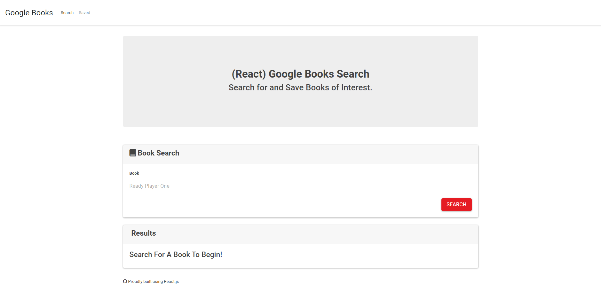
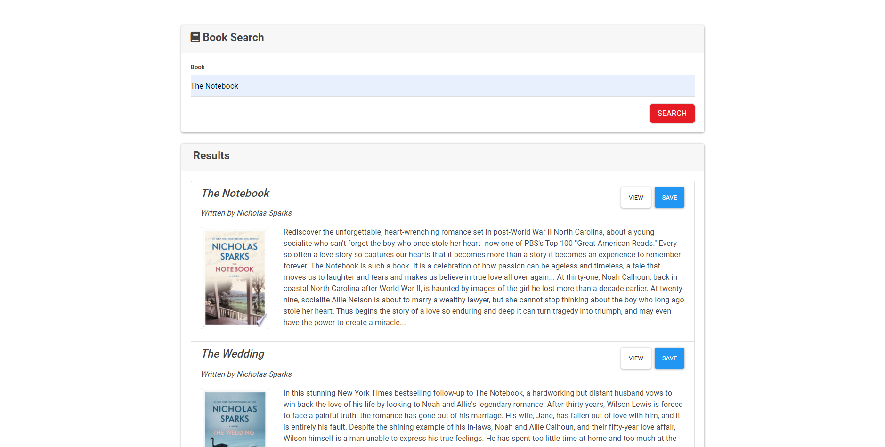
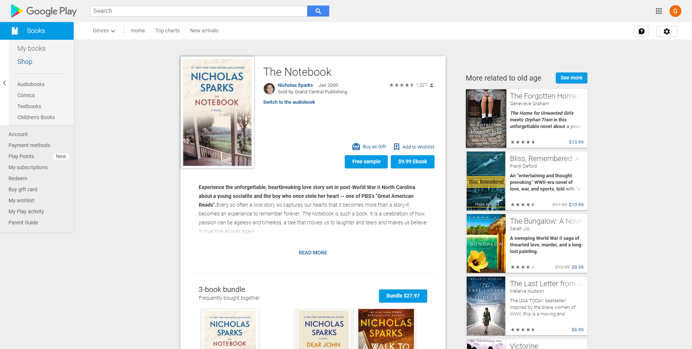
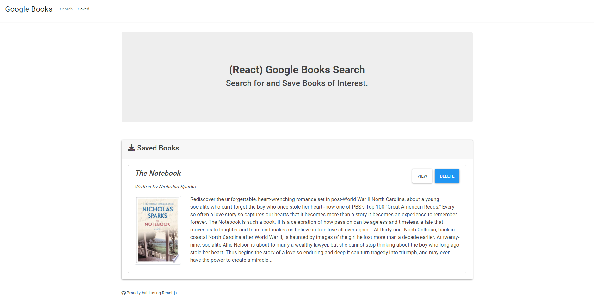

# React Google Books

## Description

The purpose of this project is to create a React-based application to search for books via Google Books Search. The user will be able to search for book titles and be able to save the search queries to a list as well as view more information on selected book. The returned search provides a list of books either identical or nearly identical to the search query, as well as displays books with similiar names and books also written by the author. In the Results field the book title, description of the book, and thumbnail are provided. Clicking the View button routes the user to a seperate [GoogleBooks]("https://books.google.com") page with more information on the book. Clicking the Save button allows the user to create a list of saved books under the Saved page where the saved books can be removed from the list.

## Table of contents

- [Installation](#installation)
- [Usage](#usage)
- [Credit](#credit)
- [Tests](#tests)
- [GitHub](#github)
- [Email](#email)
- [Questions](#questions)
- [License](#license)

<hr>

## Installation

To start using this code follow these instructions:

Fork the project and then install the required dependencies with:

```
 npm i
```

<hr>

## Usage

Either run: 

```
npm run start
``` 
in your terminal to start the application to run locally OR the application can be delpoyed to [Heroku]("https://heroku.com") which can be connected with a provisioned database.







Use the link below for a delpoyed version of this repo.

[React Google Books](https://rut-react-google-books.herokuapp.com)

<hr>

## Credit

Jelani Thomas

## Tests

No test at the moment

## GitHub

[GeloneJT](https://github.com/GeloneJT)

## Email

jelani13@icloud.com

## Questions

To reach me for questions in relation to this project or any other feel free to reach out to me via the GitHub or email listed above

## License

No License applied
